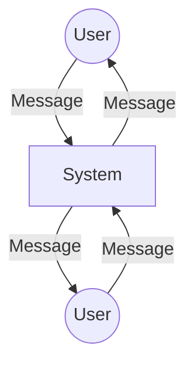

# Actors
**Visual Structure:**

## Analyse du diagrame:
- cicle(User/User2): s'envoient des méssage atravers l'application .
- le carrer : c'est notre systeme/application.
- les lines : represente l'envoir des messages.

# Fonctionnalités 
- Le systeme doit permet aux utilisateurs de se decouvrit sur le resaux
- Le systeme doit permet aux utilisateur s'envoir des messages entre tout les machine sur le meme resau.
- Le systeme doit avoir une historique des message . 
- Le systeme doit securisé la transmission des messages .

# Cas d'erreurs
- les messages vide